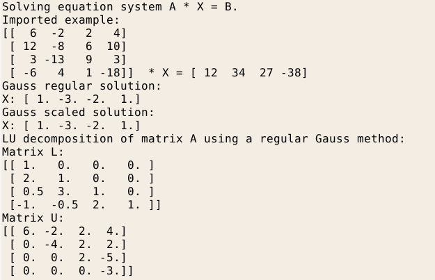
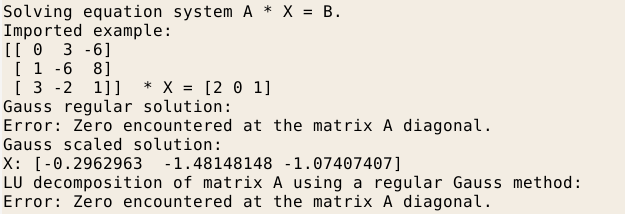
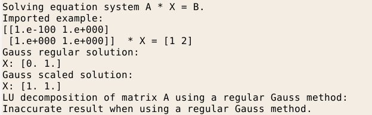
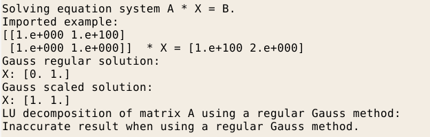

# metody4-gauss-elimination
Compared Gaussian elimination algorithms with and without partial pivoting. Doolittle method of LU decomposition.

main.py file will run though few examples of solving A*X = B equation system where A, B are matrixes. Examples are chosen so that the regular Gauss method will fail and scaled one will return the correct result.

## The instances where regular Gauss method fails are:
1. The algorithm encounters a zero at the diagonal of the matrix A.
2. The elements of matrixes are chosen so that, one of them is substantially different then others. This causes some rounding to be made, and the final result is false.

Additionally LU decomposition of the matrix A will be displayed. 
LU decomposition algorithm is based on the regular Gauss method, so all above points apply.

### Example 1

### Example 2

### Example 3

### Example 4

